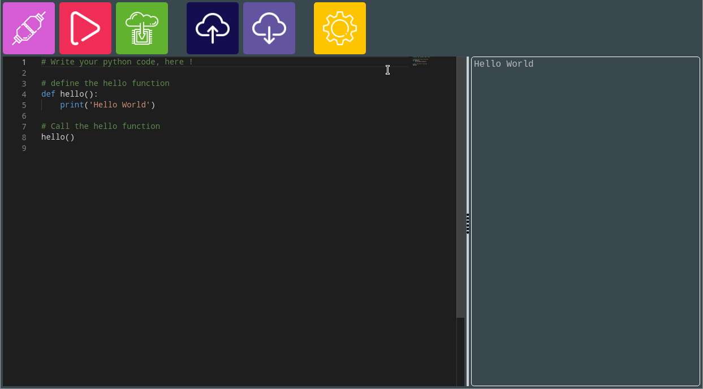

# MicroPython Let's STEAM - Experimentation

This is a simple experimentation to use MicroPython on the STM32L475 board (and STM32WB55 later).

You can test it here : [https://letssteam.github.io/micropython-experiments/](https://letssteam.github.io/micropython-experiments/)

## How to use

### Requirements

- Node.JS (>= 12.x)
- NPM (>= 7.5.2)

### Developping / Deploying / Testing :
    
1. Clone this repository `git clone https://github.com/letssteam/micropython-experiments.git`
2. Run `npm install`
3. Run `gulp` to compile and produce the static website in `dist` folder  
**BONUS** You can use `gulp --watch` to recompile after editing a file (static file or Typescript file) !
4. Run a simple HTTP server on `dist` folder (exemple: `python3 -m http.server`)

## :warning: About WebUSB
This web site use [WebUSB](https://wicg.github.io/webusb/) to flash or send programme directly from your browser to the target. **BUT** this is ONLY available on chrome based browser ([Chrome](https://www.google.com/intl/fr_fr/chrome/), [Chromium](https://www.chromium.org/getting-involved/download-chromium/), [Brave](https://brave.com/fr/), [Edge](https://www.microsoft.com/fr-fr/edge), etc)

On any other browser, neither the first two buttons (connect and flash) nor the serial output (on the right of the screen) appear.

## On last thing
THIS IS AN _EXPERIMENTATION_, please be kind :heart: